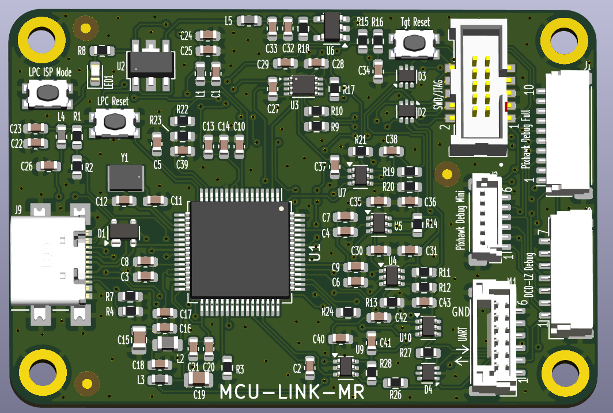
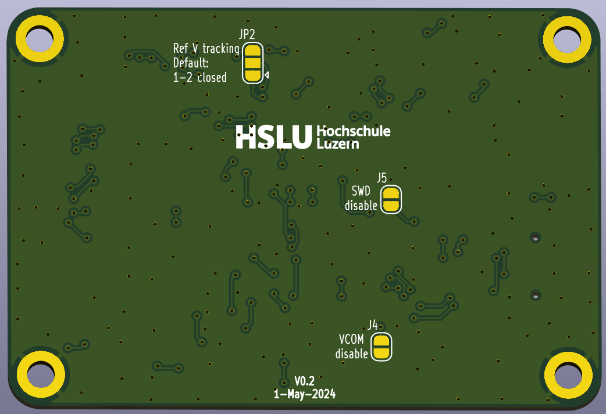
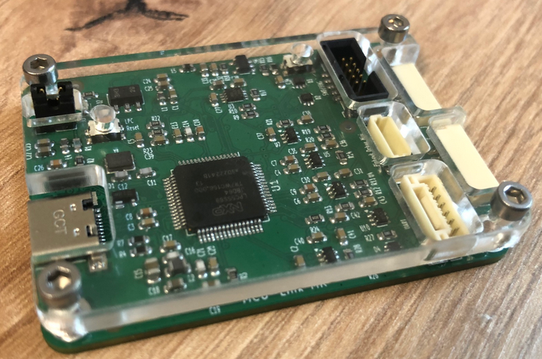

# MCU-Link-MR

Project for the NXP MCU-Link Debug Probe with KiCAD, as a debug drone for mobile robotics platforms.

## Features
Renderings below show the v0.2 version.

## Versions

### v0.1
- Initial version
- Issue with UART on debug headers (works fine on UART header) (fixed in v0.2)

### v0.2
- Improved footprints and silkscreen
- Push button instead of jumper for DFU mode
- fixed UART connection on debug headers

## Links
- Base hardware project used: https://mcuoneclipse.com/2024/02/06/versatile-oshw-mini-mcu-link-debug-probe-external-on-board-or-embedded/, GitHub: https://github.com/ErichStyger/McuLink-Mini
- NXP MCU-Link: https://www.nxp.com/design/design-center/software/development-software/mcuxpresso-software-and-tools-/mcu-link-debug-probe:MCU-LINK
- NXP LinkServer: https://www.nxp.com/design/design-center/software/development-software/mcuxpresso-software-and-tools-/linkserver-for-microcontrollers:LINKERSERVER
- MCU-Link with Cortex-Debug and LinkServer
LinkServer for Microcontrollers
