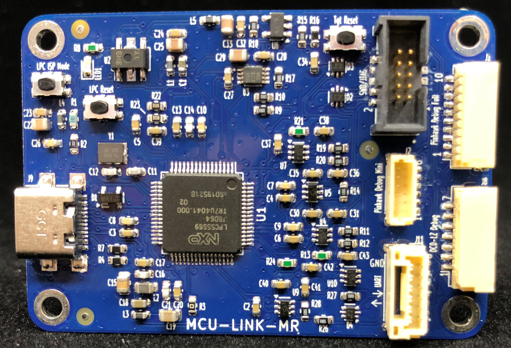

# MCU-Link-MR

Project for the NXP MCU-Link Debug Probe with KiCAD, as a debug drone for mobile robotics platforms.
See https://mcuoneclipse.com/2024/05/05/cmsis-dap-debug-probe-for-robots-and-pixhawk-with-kicad/

You can order the v0.2 board as produced by NXP: https://www.nxp.com/design/design-center/software/development-software/mcuxpresso-software-and-tools-/mcu-link-mr-debug-probe-with-usb-c-serial-and-mobile-robotics-interfaces:MCU-LINK-MR

## Features
The MCU-Link-MR is an open source debug probe, based on the original [NXP MCU-Link](https://www.nxp.com/design/design-center/software/development-software/mcuxpresso-software-and-tools-/mcu-link-debug-probe:MCU-LINK).

The MCU-Link-MR supports debugging ARM-Cortex devices plus includes multiple headers used for robots and drone projects.

- Binary firmware compatibility with the original MCU-Link debug probe
- Size: 58x40 mm, dual-layer PCB
- Laser-cut top-cover enclosure
- USB-C host connector
- Reset button for debug probe (LPC55S69) and target
- [ARM target debug header (10pin 2x1.27 mm)](https://developer.arm.com/documentation/101416/0100/Hardware-Description/Target-Interfaces/Cortex-Debug--10-pin-) to debug any ARM Cortex target
- Multiple robot and drone debug and UART connectors:
    - [Pixhawk Debug Full debug header (10pin JST-SH)](https://docs.px4.io/main/en/debug/swd_debug.html#pixhawk-debug-full) with UART
    - [Pixhawk Debug Mini debug header (6pin JST-SH)](https://docs.px4.io/main/en/debug/swd_debug.html#pixhawk-debug-mini) with UART
    - [DCD-LZ Debug header (7pin JST-GHS)](https://nxp.gitbook.io/hovergames/rddrone-fmuk66/connectors/debug-interface-dcd-lz) with UART
    - [Target UART for NavQPlus Companion Computer (6pin JST-GH)](https://nxp.gitbook.io/navqplus/hardware/hardware-interfaces/uart/uart2-a53-debug), supporting flow control (CTS/RTS) (with board rev 0.4 or later)

## PCB
Renderings below show the v0.2 version.

The first v0.1 version and the actual v0.2 version:

PCB of the v0.2:

PCB of the v0.3:

PCB of the v0.4:

## Versions
The gerber files for the different releases can be found in KiCAD project directory.

### v0.4
- fixed pull-up on CTS line to pull-down

### v0.3
- Added RTS/CTS signals with level shifters for J11/NavQPlus connector
- Issue: this PCB has pull-ups for the CTS line instead of pull-down. Fixed in v0.4

### v0.2
- Improved footprints and silkscreen
- Push button instead of jumper for DFU mode
- fixed UART connection on debug headers

### v0.1
- Initial version
- Issue with UART on debug headers (works fine on UART header) (fixed in v0.2)

## PCB Production
PCBs have been produced by PCBWay (https://www.pcbway.com/), with following settings:
- Size: 58x40 mm
- Layers: 2
- Soldermask (top, bottom): blue *(Note: green is possible too, PCBWay won't accept black because this requires minimal 0.22 mm soldermask distance between pins)*
- Silkscreen (top, bottom): white
- Material: FR4, TG 150-160
- Thickness: 1.6 mm
- Min track/spacing: 6/6 mil
- Min hole size: 0.3 mm
- Surface finish: HASL with lead *(Note: for production use HASL lead free or immersion gold (ENIG))*
- Vias: tenting vias
- Finished copper: 1 oz Cu

## Links
- Article about v0.2: https://mcuoneclipse.com/2024/05/19/mcu-link-mr-v0-2-drone-and-robot-debug-probe-with-uart-2-usb-bridge/
- Article for the project: https://mcuoneclipse.com/2024/05/05/cmsis-dap-debug-probe-for-robots-and-pixhawk-with-kicad/
- Base hardware project used: https://mcuoneclipse.com/2024/02/06/versatile-oshw-mini-mcu-link-debug-probe-external-on-board-or-embedded/, GitHub: https://github.com/ErichStyger/McuLink-Mini
- NXP MCU-Link: https://www.nxp.com/design/design-center/software/development-software/mcuxpresso-software-and-tools-/mcu-link-debug-probe:MCU-LINK
- NXP LinkServer: https://www.nxp.com/design/design-center/software/development-software/mcuxpresso-software-and-tools-/linkserver-for-microcontrollers:LINKERSERVER
- MCU-Link with Cortex-Debug and LinkServer: https://mcuoneclipse.com/2023/11/27/mcu-link-with-cortex-debug-and-linkserver/
- LinkServer for Microcontrollers: https://mcuoneclipse.com/2023/05/14/linkserver-for-microcontrollers/
